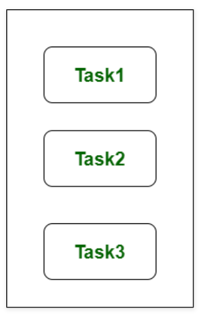
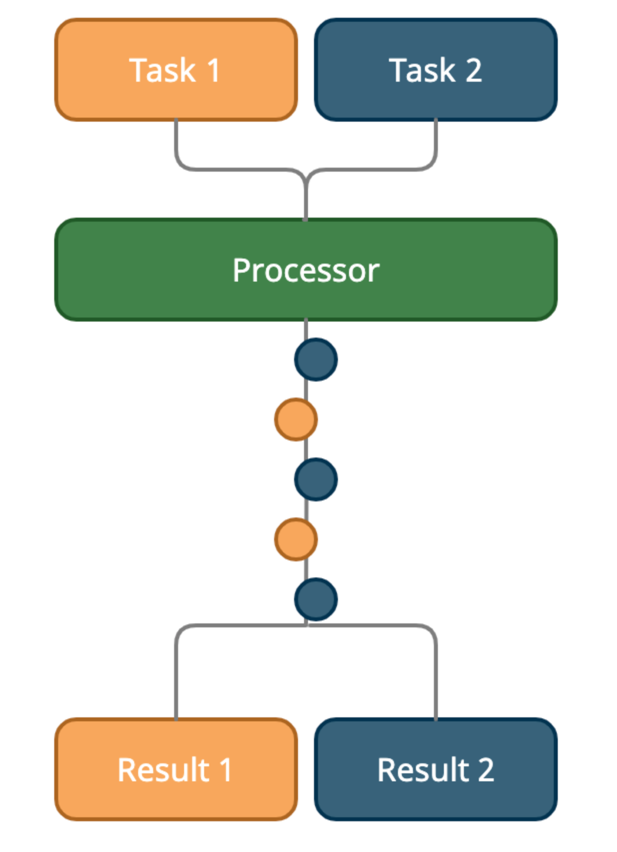
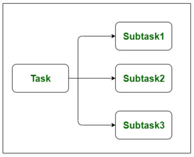
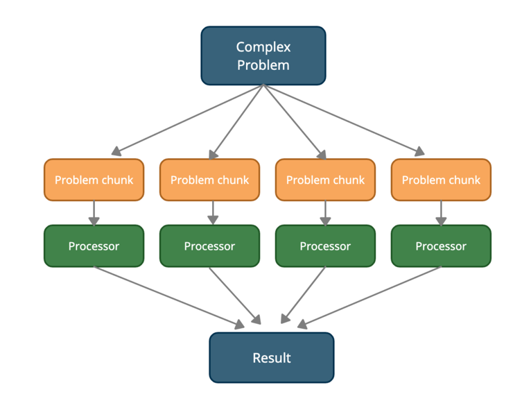

## Concurrency?

1. Concurrency relates to an application that is processing more than one task at the same time
2. Concurrency is an approach that is used for decreasing the response time of the system by using the single processing unit.
3. Task1 (T1) -> Task2 (T2) -> Task1 (T3) -> Task3 (T4) -> Task1 Finish -> Task3 Finish -> Task2 Finish

## Parallelism

1. Parallelism is related to an application where  tasks are divided into smaller sub-tasks that are processed seemingly simultaneously or parallel
2. It is used to increase the throughput and computational speed of the system by using multiple processors.
3. It enables single sequential CPUs to do a lot of things “seemingly” simultaneously.
4. Subtask1 (T1, C1) -> Subtask2 (T1, C2) -> Subtask3 (T1, C3) -> Task Finish

### How it works in Go?
